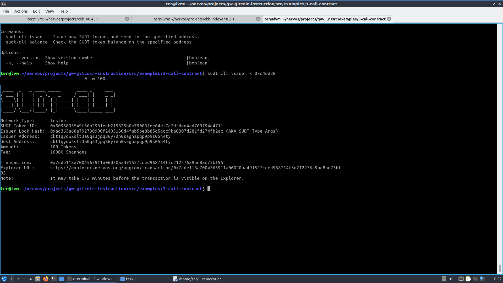
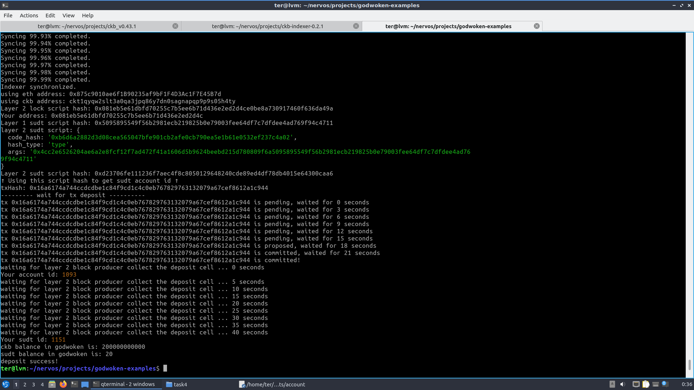

## 1. A link to the Layer 1 address you funded on the Testnet Explorer.
[https://explorer.nervos.org/aggron/address/ckt1qyqw2slt3a0qa3jpq86y7dn0sagnapqp9p9s05h4ty](https://explorer.nervos.org/aggron/address/ckt1qyqw2slt3a0qa3jpq86y7dn0sagnapqp9p9s05h4ty)
## 2. A screenshot of the console output immediately after using sudt-cli to create your SUDT tokens on Layer 1.

## 3. A link to the transaction ID created by sudt-cli on the Testnet Explorer.
[https://explorer.nervos.org/aggron/transaction/0x7cde118a7004563911a06020aa491527cced968714f3e212276a9bc8ae73bf95](https://explorer.nervos.org/aggron/transaction/0x7cde118a7004563911a06020aa491527cced968714f3e212276a9bc8ae73bf95)
## 4. A screenshot of the console output immediately after you have successfully submitted a deposit to Layer 2 using the account-cli tool.

## 5. The SUDT ID from the console output after executing the deposit script (in text format).
1115
