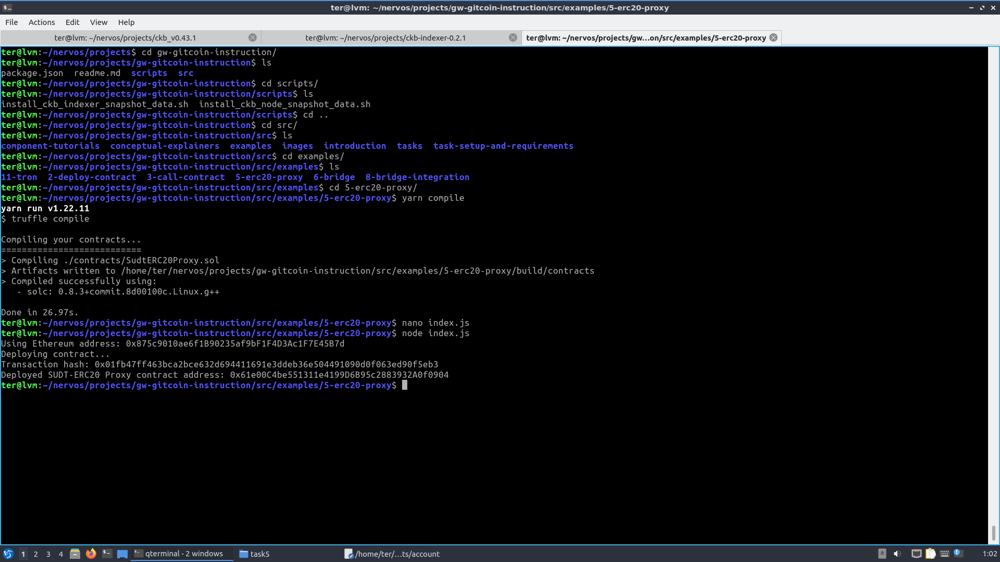
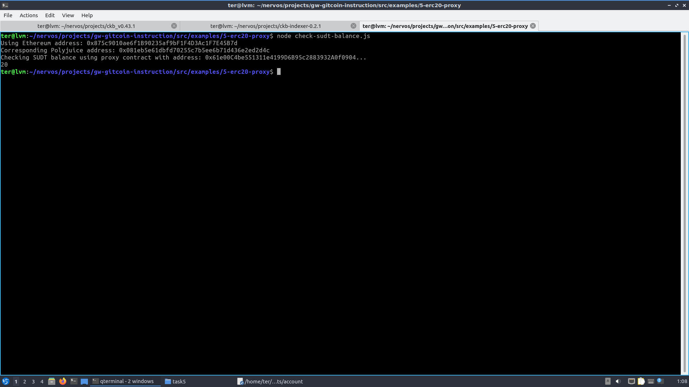

## A screenshot of the console output immediately after deploying smart contract.

## The address of the ERC20 Proxy Contract you deployed (in text format).

0x61e00C4be551311e4199D6B95c2883932A0f0904

## A screenshot of the console output immediately after checking your SUDT balance.

## The Ethereum address that was checked (in text format).

0x875c9010ae6f1B90235af9bF1F4D3Ac1F7E45B7d
