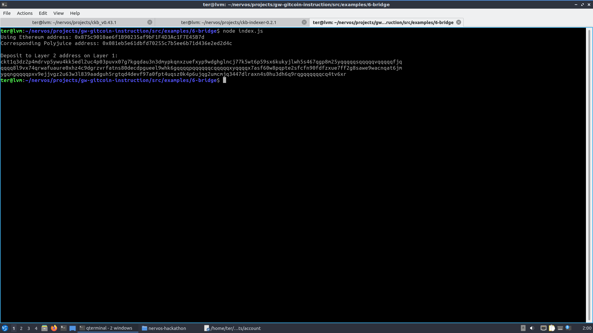
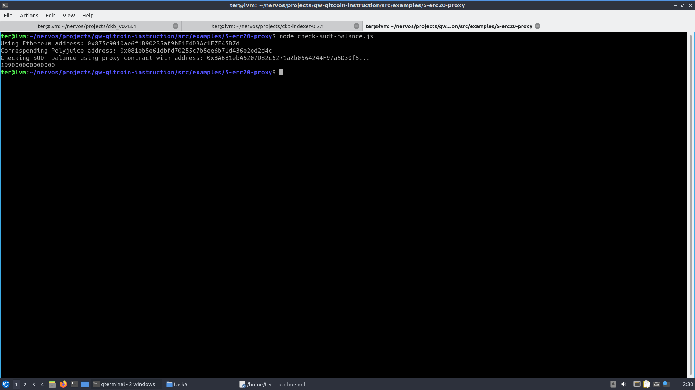

## 1. A screenshot of the console output immediately after you have successfully generated your Deposit Receiver Address.

## 2. Your Deposit Receiver Address (in text format).
ckt1q3dz2p4mdrvp5ywu4kk5edl2uc4p03puvx07g7kgqdau3n3dmypkqnxzuefxyp9wdghglncj77k5wt6p59sx6kukyjlwh5s467qgp8m25yqqqqqsqqqqqvqqqqqfjqqqqq8l9vx74qrwafuaure0xhz4c9dgrzvrfatns80decdpgueel9whk6gqqqqpqqqqqqcqqqqqxyqqqqx7asf60w8pqpte2sfcfn90fdfzxue7ff2g8sawe9wacnqat6jmygqngqqqqpxv9ejjvgz2u63w3l839aadguh5rgtqd4devf97a0fpt4uqsz0k4p6ujqg2umcmjq3447dlraxn4s0hu3dh6q9rqgqqqqqqcq4tv6xr
## 3. The Ethereum address used to generate the Deposit Receiver Address (in text format).
0x875c9010ae6f1B90235af9bF1F4D3Ac1F7E45B7d
## 4. A link to the Etherscan explorer for the successful Force Bridge transaction. This can be found on Force Bridge under History→Succeed.
[https://rinkeby.etherscan.io/tx/0xb5a924b251f4d73a6d0ed2b46f7c1a262938e3309f6dd1bf47ab9711ea551282](https://rinkeby.etherscan.io/tx/0xb5a924b251f4d73a6d0ed2b46f7c1a262938e3309f6dd1bf47ab9711ea551282)
## 5. A link to the Nervos explorer for the successful Force bridge transaction. This can be found on Force Bridge under History→Succeed.
[https://explorer.nervos.org/aggron/transaction/0xc82f3f8e18f7d3d929be03391b5636395b2371d9c5c2fe1bcb53cc736de698cd](https://explorer.nervos.org/aggron/transaction/0xc82f3f8e18f7d3d929be03391b5636395b2371d9c5c2fe1bcb53cc736de698cd)
## BONUS. Check Your Layer 2 Balance

