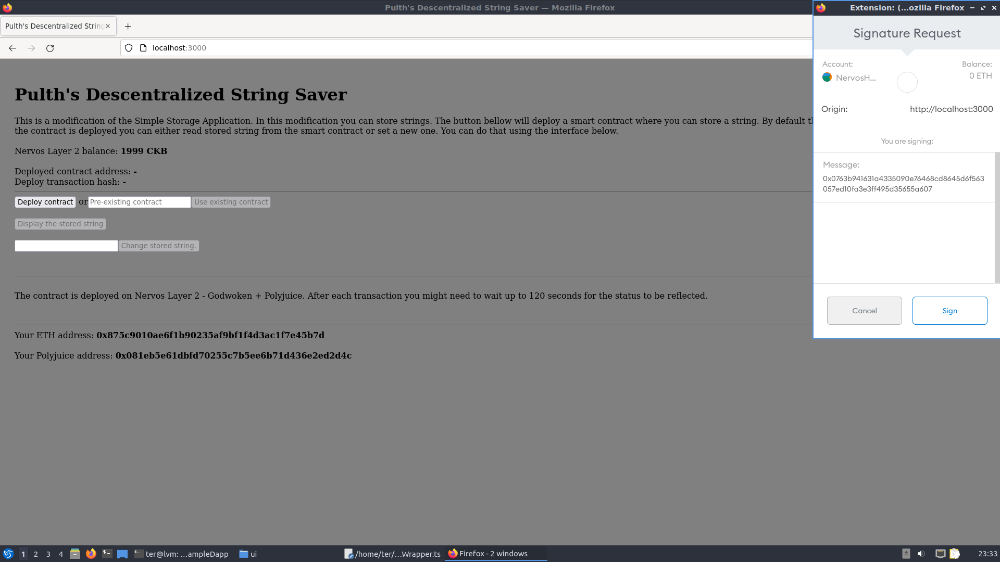
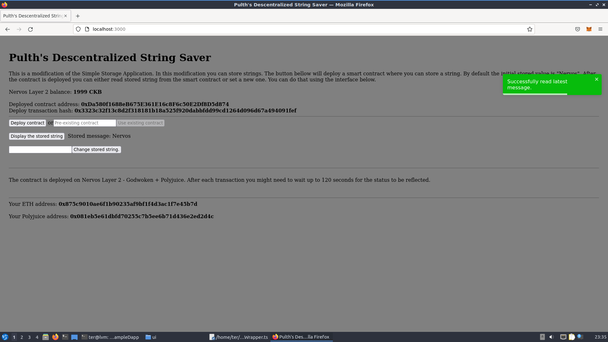
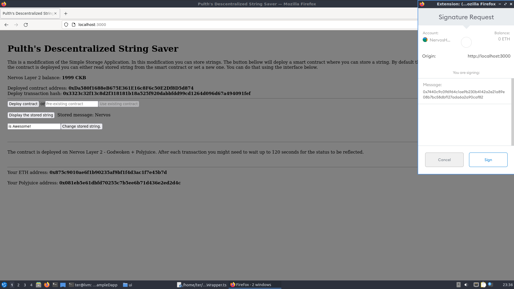
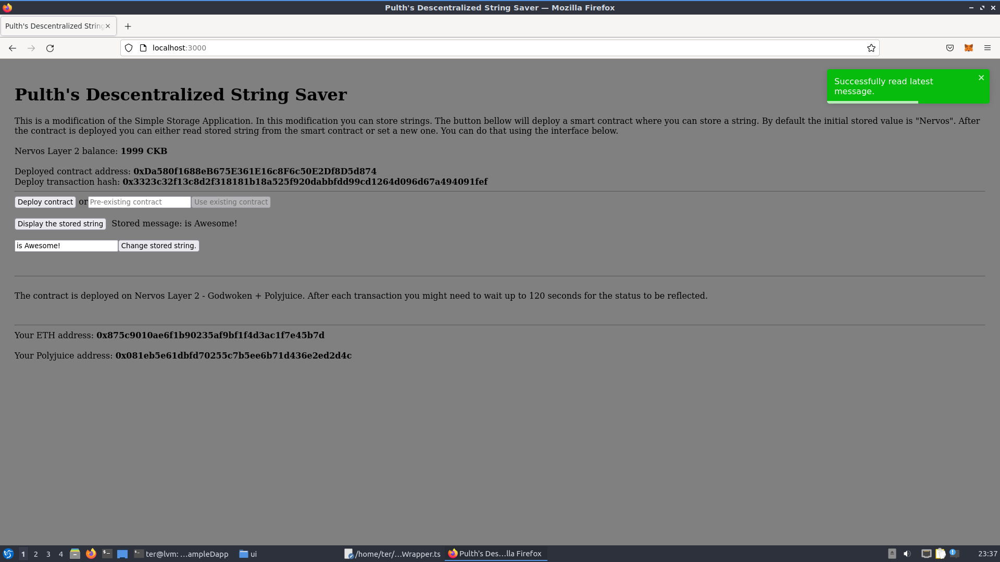

# Task 7 - Port An Existing Ethereum DApp To Polyjuice
---
## 1) Screenshot of Application on Godwin




---
## 2) Link to Gitub Repository:
https://github.com/pulth/nervos-hackathon/tree/main/task7/app
---
## 3) Transaction Hash of Deployment Transaction:
```
0x3323c32f13c8d2f318181b18a525f920dabbfdd99cd1264d096d67a494091fef
```
---
## 4) Deployed Contract Address:
```
0xDa580f1688eB675E361E16c8F6c50E2Df8D5d874
```
## 5) ABI:
```
[
    {
      "inputs": [],
      "stateMutability": "payable",
      "type": "constructor"
    },
    {
      "inputs": [
        {
          "internalType": "string",
          "name": "x",
          "type": "string"
        }
      ],
      "name": "set",
      "outputs": [],
      "stateMutability": "nonpayable",
      "type": "function"
    },
    {
      "inputs": [],
      "name": "get",
      "outputs": [
        {
          "internalType": "string",
          "name": "",
          "type": "string"
        }
      ],
      "stateMutability": "view",
      "type": "function"
    }
  ]
```
