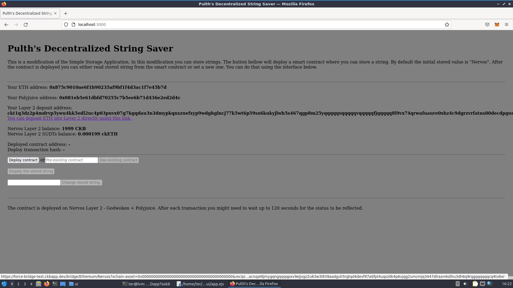
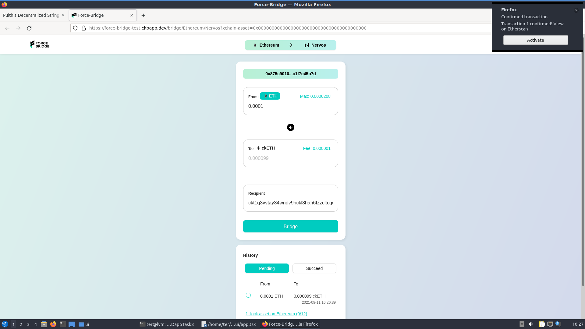
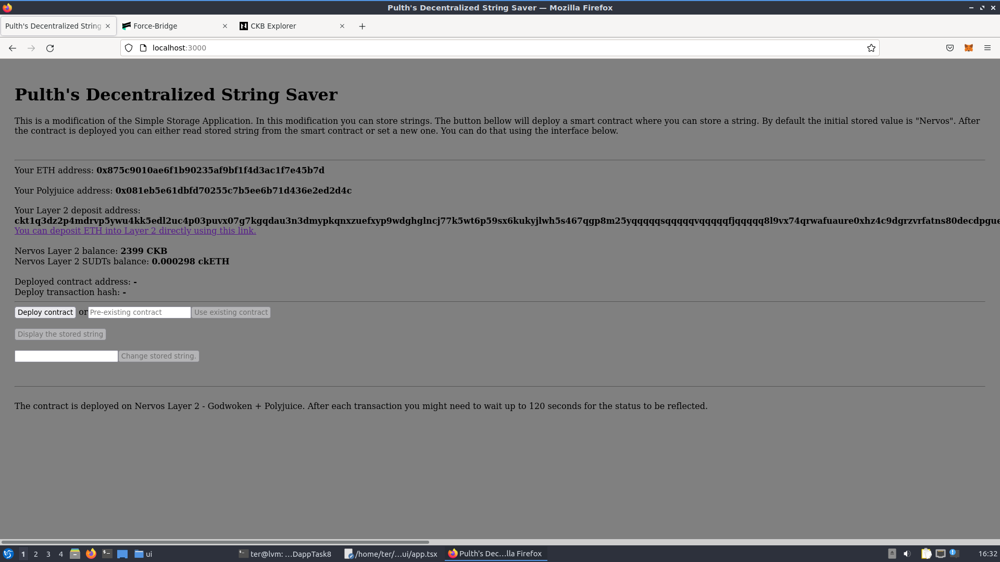

# 8) Modify the Ported dApp so it Supports Ethereum Assets via Force Bridge


## 1. A screenshot or video of your EVM application on Layer 2 with Force Bridge support.





## 2. The address of the SUDT-ERC20 Proxy Contract that you deployed (in text format).
```
0x8AB81ebA5207D82c6271a2b0564244F97a5D30f5
```

## 3. A link to the GitHub repository with your EVM application that integrates Force Bridge support.

https://github.com/pulth/nervos-hackathon/tree/main/task8/app
